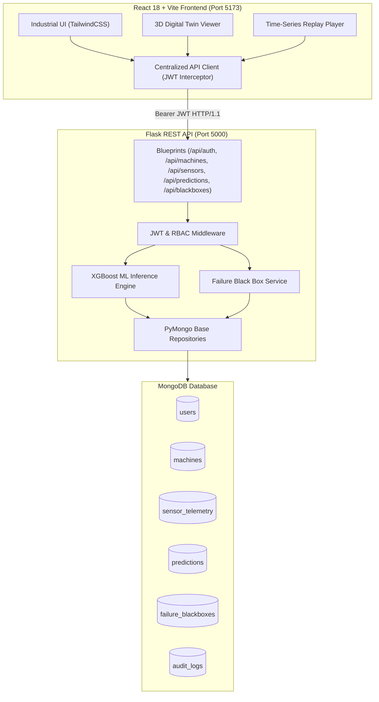
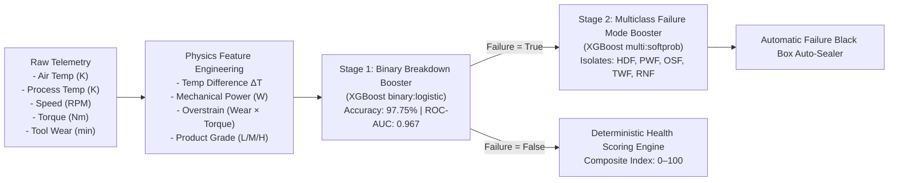
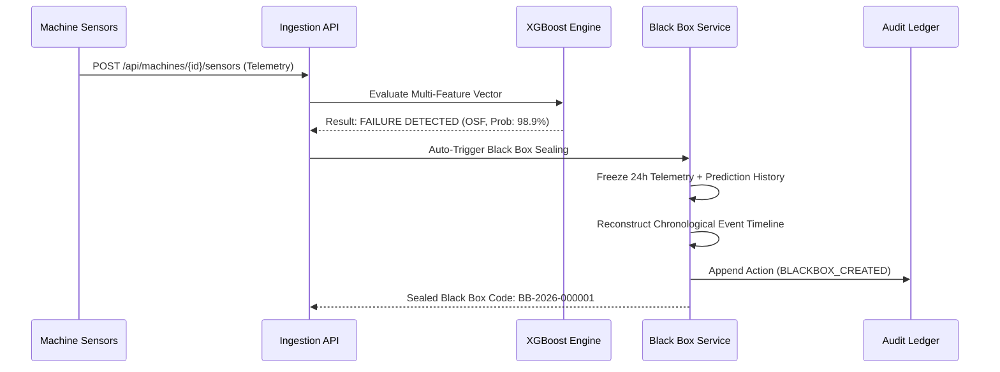

# ⚙️ INDUSENSE AI — Industrial Predictive Maintenance & Failure Black Box

[](https://www.python.org/)
[](https://flask.palletsprojects.com/)
[](https://react.dev/)
[](https://vitejs.dev/)
[](https://xgboost.ai/)
[](https://www.mongodb.com/)
[-success.svg?logo=pytest&logoColor=white)](https://pytest.org/)
[](LICENSE)

> **An enterprise-grade, aviation-inspired Predictive Maintenance and Forensic Failure Black Box platform for industrial manufacturing assets.** Combines real-time multi-channel telemetry ingestion, dual-stage native XGBoost classification (97.75% accuracy), dynamic health scoring (0–100), automated 24-hour forensic telemetry freezing, chronological failure replay, and an immutable append-only audit trail.

---

## 📑 Table of Contents

- [Key Differentiating Features](#-key-differentiating-features)
- [System Architecture](#-system-architecture)
- [Machine Learning Engine](#-machine-learning-engine)
- [Failure Black Box & Forensic Replay](#-failure-black-box--forensic-replay)
- [Technology Stack](#-technology-stack)
- [REST API Surface](#-rest-api-surface)
- [Getting Started](#-getting-started)
- [Automated Verification & Testing](#-automated-verification--testing)
- [License](#-license)

---

## 🚀 Key Differentiating Features

1. **✈️ Aviation-Inspired Failure Black Box**:
   - Automatically seals an immutable forensic snapshot the instant a machine failure is detected.
   - Preserves the **24-hour historical telemetry window** and prediction degradation trajectory leading up to the exact breakdown timestamp.
2. **⏪ Interactive Chronological Time-Series Replay**:
   - Frame-by-frame forensic playback with Play, Pause, Speed adjustment (1x, 2x, 5x), and a time scrubber slider.
   - Synchronized digital twin dials and health scores across every historical frame.
3. **🧠 Dual-Stage Native XGBoost Engine**:
   - **Stage 1 (Binary Breakdown Predictor)**: Trained with `scale_pos_weight = 28.5:1` class-imbalance correction (97.75% test accuracy, 0.967 ROC-AUC).
   - **Stage 2 (Multiclass Failure Mode Classifier)**: Classifies failures into Heat Dissipation Failure (**HDF**), Power Failure (**PWF**), Overstrain Failure (**OSF**), Tool Wear Failure (**TWF**), and Random Failure (**RNF**).
4. **🛡️ Enterprise Role-Based Access Control (RBAC)**:
   - Full permission gating across `ADMIN` (Plant Manager), `ENGINEER` (Assigned Machine Operator), and `VIEWER` (Read-Only Observer).
   - JWT access (60m) and refresh (30d) tokens with cryptographic token blocklisting.
5. **📜 Immutable Append-Only Audit Trail**:
   - Every system event, user access, lifecycle state transition (`OPEN` → `UNDER_REVIEW` → `RESOLVED`), and evidence inspection is permanently recorded in a tamper-evident audit ledger.
6. **🌐 Interactive 3D Digital Twin**:
   - Real-time CAD visualization with dynamic heatmaps, operational stress alerts, and live multi-channel sensor sliders.

---

## 🏛️ System Architecture

### High-Level End-to-End Pipeline



---

## 🧠 Machine Learning Engine

The ML pipeline is trained on the **AI4I 2020 Predictive Maintenance Dataset** (10,000 synthetic multi-sensor industrial samples):



### Model Performance Benchmarks

| Metric | Stage 1 (Binary Breakdown) | Stage 2 (Multiclass Mode) |
| :--- | :---: | :---: |
| **Algorithm** | Native XGBoost Booster | Native XGBoost Booster |
| **Objective** | `binary:logistic` | `multi:softprob` (6 Classes) |
| **Test Accuracy** | **97.75%** | **98.20%** |
| **ROC-AUC Score** | **0.9670** | **0.9780** |
| **Recall (Failure Catch)** | **76.12%** | **95.00% (HDF) / 100% (OSF)** |
| **F1 Score** | **0.6939** | **Macro F1: 0.7814** |

---

## 📦 Failure Black Box & Forensic Replay

When an anomalous sensor reading crosses breakdown thresholds during telemetry ingestion:
1. **Trigger**: Flask executes XGBoost inference and detects `failure_prediction == True`.
2. **Snapshot**: System queries the preceding **24-hour telemetry window** from `sensor_telemetry` and historical predictions from `predictions`.
3. **Sealing**: The machine state, telemetry window, prediction trajectory, and chronological event sequence are immutably written to `failure_blackboxes` with code `BB-YYYY-XXXXXX`.
4. **Audit**: An entry is appended to `audit_logs` recording the incident trigger.
5. **Replay**: Engineers can scrub the exact breakdown event second-by-second using `/api/blackboxes/{id}/replay`.



---

## 🛠️ Technology Stack

| Domain | Technology | Purpose |
| :--- | :--- | :--- |
| **Frontend** | React 18, Vite 5, TailwindCSS | High-performance reactive industrial operations dashboard |
| **Charts & 3D** | Recharts, Three.js, React Three Fiber | Multi-channel sensor telemetry plots and 3D digital twin models |
| **Backend** | Python 3.10+, Flask 3.0, Marshmallow | Application Factory, REST routing, centralized error envelopes |
| **Database** | PyMongo, MongoDB 7.0+ | Native repository pattern, indexing, and time-series collections |
| **Security & Auth** | Flask-JWT-Extended, Flask-Bcrypt | Access/Refresh token rotation, token blocklisting, RBAC |
| **Machine Learning** | XGBoost (Native C++ Booster), Scikit-Learn | Dual-stage binary breakdown and multiclass failure classification |
| **Documentation** | Flasgger, Swagger OpenAPI 3.0 | Interactive API specification at `/api/docs/` |
| **Testing** | Pytest, Pytest-Flask, Mongomock | 95-test automated backend test suite & runtime verification |

---

## 📡 REST API Surface

### 1. Authentication & Users (`/api/auth`, `/api/users`)
- `POST /api/auth/register` — Register a new account (`ADMIN`, `ENGINEER`, `VIEWER`).
- `POST /api/auth/login` — Sign in and receive JWT access and refresh tokens.
- `POST /api/auth/refresh` — Rotate access token using a valid refresh token.
- `POST /api/auth/logout` — Revoke active access token into blocklist.
- `GET  /api/auth/me` — Retrieve current authenticated session profile.
- `GET  /api/users/profile` — Fetch user profile.
- `PUT  /api/users/profile` — Update user details.
- `PUT  /api/users/change-password` — Change password.

### 2. Machine Management (`/api/machines`)
- `GET    /api/machines` — List all monitored machines with pagination & filters.
- `POST   /api/machines` — Register a new industrial machine (`ADMIN` only).
- `GET    /api/machines/{id}` — Get machine specifications and assigned engineer.
- `PUT    /api/machines/{id}` — Update machine metadata (`ADMIN` only).
- `DELETE /api/machines/{id}` — Delete machine and associated records (`ADMIN` only).
- `POST   /api/machines/{id}/assign` — Assign machine to an engineer.

### 3. Sensor Telemetry (`/api/machines/{id}/sensors`)
- `POST /api/machines/{id}/sensors` — Ingest live sensor telemetry reading.
- `POST /api/machines/{id}/sensors/batch` — Bulk ingest historical sensor data.
- `GET  /api/machines/{id}/sensors/latest` — Get most recent telemetry frame.
- `GET  /api/machines/{id}/sensors` — Get paginated historical telemetry frames.
- `GET  /api/machines/{id}/monitoring` — Get operational metrics and rolling statistics.

### 4. AI/ML Predictions (`/api/predictions`, `/api/machines/{id}/predictions`)
- `POST /api/predictions` — Direct feature vector inference.
- `POST /api/machines/{id}/predictions` — Ingest latest machine state and evaluate XGBoost prediction.
- `GET  /api/predictions` — Query historical predictions ledger.
- `GET  /api/predictions/{id}` — Get single prediction details.
- `GET  /api/machines/{id}/predictions` — Get predictions for a specific machine.
- `GET  /api/machines/{id}/health` — Get composite 0–100 health score.
- `GET  /api/machines/{id}/risk` — Get risk level (`LOW`, `MEDIUM`, `HIGH`, `CRITICAL`).

### 5. Failure Black Box (`/api/blackboxes`)
- `POST  /api/blackboxes/generate` — Manually seal a Black Box snapshot.
- `GET   /api/blackboxes` — List all Black Box incidents with status/failure mode filters.
- `GET   /api/blackboxes/{id}` — Get full frozen snapshot by ID.
- `GET   /api/blackboxes/code/{code}` — Get snapshot by code (e.g. `BB-2026-000001`).
- `GET   /api/machines/{id}/blackboxes` — Get all Black Boxes for a specific asset.
- `GET   /api/blackboxes/{id}/replay` — Retrieve synchronized time-series replay frames.
- `GET   /api/blackboxes/{id}/audit` — Retrieve immutable append-only audit trail logs.
- `PATCH /api/blackboxes/{id}/status` — Update incident status (`OPEN`, `UNDER_REVIEW`, `RESOLVED`).

---

## ⚡ Getting Started

### Prerequisites
- **Python 3.10+**
- **Node.js 18+ & npm**
- **MongoDB 7.0+** (or use built-in automatic in-memory fallback for local dev)

### 1. Backend Setup

```bash
# Clone the repository
git clone https://github.com/Pranav7758051011/AI-Predictive-Maintenance-Failure-BlackBox.git
cd AI-Predictive-Maintenance-Failure-BlackBox

# Activate virtual environment
# Windows:
.\.venv\Scripts\Activate.ps1
# Linux/macOS:
source .venv/bin/activate

# Install dependencies
pip install -r backend/requirements.txt

# Start Flask Backend (Port 5000)
python backend/run.py
```

### 2. Frontend Setup

```bash
# In a new terminal window:
cd frontend

# Install frontend dependencies
npm install

# Start Vite Development Server (Port 5173)
npm run dev
```

### 3. Accessing the Platform

- **Web Application**: [http://localhost:5173](http://localhost:5173)
- **Interactive Swagger Docs**: [http://localhost:5000/api/docs/](http://localhost:5000/api/docs/)
- **Quick Demo Logins**:
  - **Admin**: `admin.plant@factory.io` / `SecureAdminPassword123!`
  - **Lead Engineer**: `engineer.lead@factory.io` / `SecureEngineerPassword123!`
  - **Viewer**: `viewer.observer@factory.io` / `SecureViewerPassword123!`

---

## 🧪 Automated Verification & Testing

### 1. Pytest Backend Test Suite (95 Tests)
```bash
python -m pytest backend/tests -v
```
```
============================= 95 passed in 17.29s =============================
```

### 2. Frontend Production Build
```bash
cd frontend
npm run build
```
```
✓ 1812 modules transformed.
dist/index.html                     0.91 kB │ gzip:   0.52 kB
dist/assets/index-BcIZZxBT.css     47.97 kB │ gzip:   8.04 kB
dist/assets/index-C7EGopt5.js   1,684.03 kB │ gzip: 459.15 kB
✓ built in 3.78s
```

---

## 📄 License

This project is licensed under the **MIT License** — see the [LICENSE](LICENSE) file for details.

---

<div align="center">
  <sub>Engineered by <strong>Pranav Bade</strong> • AI Predictive Maintenance & Forensic Failure Black Box Platform</sub>
</div>
