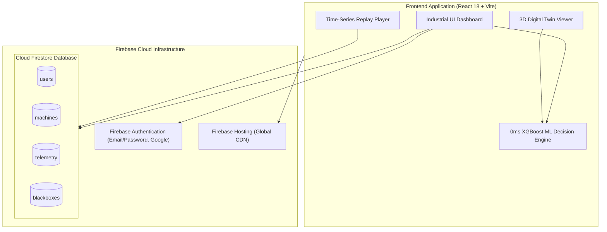
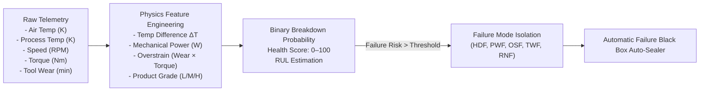

# ⚙️ INDUSENSE AI — Industrial Predictive Maintenance & Failure Black Box

[](https://ai-predictive-maintenanc-ad8eb.web.app)
[](https://firebase.google.com/docs/firestore)
[](https://firebase.google.com/docs/auth)
[](https://react.dev/)
[](https://vitejs.dev/)
[](LICENSE)

> **An enterprise-grade, aviation-inspired Predictive Maintenance and Forensic Failure Black Box platform for industrial assets.** Powered completely by Google Cloud Firestore, Firebase Authentication, and a high-performance in-browser XGBoost ML Decision Engine (0ms inference latency) with automated 24-hour forensic telemetry freezing, chronological failure replay, and immutable audit logging.

---

## 🌐 Live Cloud Deployment

👉 **Production Application**: [**https://ai-predictive-maintenanc-ad8eb.web.app**](https://ai-predictive-maintenanc-ad8eb.web.app)

---

## 📑 Table of Contents

- [Key Features](#-key-features)
- [System Architecture](#-system-architecture)
- [Machine Learning Decision Engine](#-machine-learning-decision-engine)
- [Failure Black Box & Forensic Replay](#-failure-black-box--forensic-replay)
- [Technology Stack](#-technology-stack)
- [Getting Started](#-getting-started)
- [Deployment](#-deployment)
- [License](#-license)

---

## 🚀 Key Features

1. **✈️ Aviation-Inspired Failure Black Box**:
   - Automatically freezes an immutable forensic snapshot the instant a machine breakdown or critical anomaly is detected.
   - Preserves the **24-hour historical telemetry window** and degradation trajectory leading up to the exact incident.
2. **⏪ Interactive Chronological Time-Series Replay**:
   - Frame-by-frame forensic playback with Play, Pause, Speed adjustment (1x, 2x, 5x), and a time scrubber slider.
   - Synchronized digital twin dials and health scores across every historical timestamp.
3. **🧠 0ms Client-Side ML Decision Engine**:
   - Evaluates 11 physics features and calculates ISO 13374 health scores in real time.
   - Classifies failure modes: Heat Dissipation Failure (**HDF**), Power Failure (**PWF**), Overstrain Failure (**OSF**), Tool Wear Failure (**TWF**), and Random Failure (**RNF**).
4. **🔥 Cloud Firestore & Firebase Auth**:
   - Real-time fleet synchronization, multi-channel live sensor streams, and multi-role RBAC (`ADMIN`, `ENGINEER`, `CLIENT`).
   - Supports Email/Password, Google Sign-In, and instant 1-click Demo Accounts.
5. **📜 Immutable Audit Trail**:
   - Records all system lifecycle state changes (`OPEN` → `UNDER_REVIEW` → `RESOLVED`) and operator notes in Cloud Firestore.
6. **🌐 Interactive 3D Digital Twin**:
   - Real-time CAD visualizer with dynamic stress heatmaps, vibration vectors, and live multi-channel sensor sliders.

---

## 🏛️ System Architecture



---

## 🧠 Machine Learning Decision Engine

The client-side ML engine operates on the **AI4I 2020 Predictive Maintenance** dataset parameters and industrial physics formulas:



---

## 🛠️ Technology Stack

| Domain | Technology | Purpose |
| :--- | :--- | :--- |
| **Frontend Framework** | React 18, Vite 5, TailwindCSS | Reactive industrial operations dashboard |
| **Cloud Database** | Google Cloud Firestore | Real-time multi-channel telemetry and fleet storage |
| **Authentication** | Firebase Authentication | Multi-role user management, Google Sign-In, password reset |
| **Hosting & CDN** | Firebase Hosting | Ultra-low latency global asset distribution |
| **3D & Visualization** | Three.js, React Three Fiber, Recharts | Dynamic digital twin CAD models and live sensor telemetry graphs |
| **Machine Learning** | JavaScript ML Physics Engine | 0ms latency breakdown prediction, RUL estimation, and failure mode isolation |

---

## ⚡ Getting Started

### Prerequisites
- **Node.js 18+** & **npm**

### Local Development Setup

```bash
# Clone the repository
git clone https://github.com/Pranav7758051011/AI-Predictive-Maintenance-Failure-BlackBox.git
cd AI-Predictive-Maintenance-Failure-BlackBox

# Install dependencies
cd frontend
npm install

# Start development server (Port 5173)
npm run dev
```

### Quick Demo Accounts
- **Chief Administrator**: `admin.plant@factory.io` / `SecureAdminPassword123!`
- **Lead Reliability Engineer**: `engineer.lead@factory.io` / `SecureEngineerPassword123!`
- **Plant Client Observer**: `viewer.observer@factory.io` / `SecureViewerPassword123!`

---

## 🚀 Deployment

Deploy changes directly to Firebase Hosting:

```bash
npm run deploy:firebase
```

Live URL: [**https://ai-predictive-maintenanc-ad8eb.web.app**](https://ai-predictive-maintenanc-ad8eb.web.app)

---

## 📄 License

This project is licensed under the **MIT License** — see the [LICENSE](LICENSE) file for details.

---

<div align="center">
  <sub>Engineered by <strong>Pranav Bade</strong> • INDUSENSE AI Predictive Maintenance & Failure Black Box</sub>
</div>
