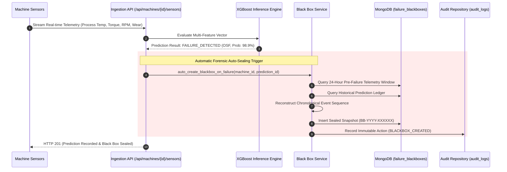
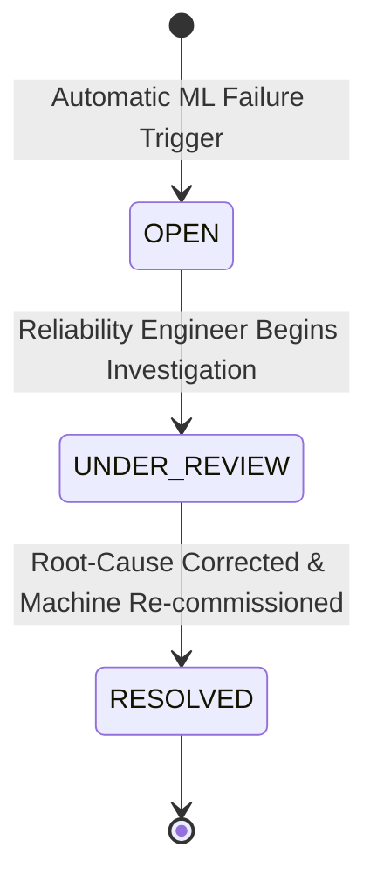

# ✈️ Failure Black Box & Forensic Replay Subsystem Specification

**Document Version:** 1.0.0  
**Target Repository:** `AI-Predictive-Maintenance-Failure-BlackBox`  
**Classification:** Core Subsystem Architectural Specification  

---

## 1. Executive Summary

The **Failure Black Box** is an aviation-inspired forensic preservation engine for industrial assets. When real-time machine telemetry crosses anomalous thresholds and the native XGBoost ML model detects a breakdown condition, the system automatically creates a tamper-evident, sealed snapshot capturing:

1. **Frozen Machine State**: Equipment specifications, location, operational parameters at time of incident.
2. **24-Hour Telemetry Window**: Time-series sensor history preceding the exact breakdown second.
3. **Prediction Degradation Trajectory**: Historical ML inference confidence and degradation scores leading to failure.
4. **Reconstructed Event Timeline**: Chronological lifecycle sequence (`WINDOW_START` $\rightarrow$ `HEALTH_DEGRADATION` $\rightarrow$ `FAILURE_DETECTED` $\rightarrow$ `BLACKBOX_SEALED`).
5. **Interactive Replay Stream**: Synchronized frame-by-frame time-series playback for forensic engineering review.
6. **Append-Only Audit Ledger**: Tamper-evident record of all lifecycle transitions and investigative views.

---

## 2. Architecture & Data Flow



---

## 3. MongoDB Document Schema (`failure_blackboxes`)

```json
{
  "_id": "6a9729409589e465765035e9",
  "blackbox_code": "BB-2026-000001",
  "machine_id": "6a9729409589e465765035db",
  "machine_snapshot": {
    "name": "5-Axis Heavy CNC Milling Center",
    "serial_number": "CNC-204",
    "product_type": "M",
    "location": "Bay 4 - Sector A",
    "rated_power_kw": 15.0
  },
  "trigger_source": "AUTOMATIC_ML_TRIGGER",
  "failure_timestamp": "2026-09-02T14:24:48.120Z",
  "incident_status": "OPEN",
  "failure_summary": {
    "failure_predicted": true,
    "failure_type": "Overstrain Failure (OSF)",
    "failure_probability": 0.9896,
    "health_score_at_failure": 0.0,
    "trigger_prediction_id": "6a9729409589e465765035ea"
  },
  "telemetry_window": [
    {
      "timestamp": "2026-09-02T13:24:48.000Z",
      "air_temp": 298.1,
      "process_temp": 308.6,
      "rotational_speed": 1550.0,
      "torque": 42.0,
      "tool_wear": 20.0,
      "delta_temp": 10.5,
      "mechanical_power": 6817.25,
      "health_score": 98.0
    },
    {
      "timestamp": "2026-09-02T14:24:48.000Z",
      "air_temp": 298.0,
      "process_temp": 313.5,
      "rotational_speed": 1200.0,
      "torque": 72.0,
      "tool_wear": 230.0,
      "delta_temp": 15.5,
      "mechanical_power": 9047.78,
      "health_score": 0.0
    }
  ],
  "event_timeline": [
    { "event_type": "WINDOW_START", "timestamp": "2026-09-01T14:24:48Z", "description": "24-hour observation window opened." },
    { "event_type": "HEALTH_DEGRADATION", "timestamp": "2026-09-02T14:10:00Z", "description": "Machine health score dropped below 50%." },
    { "event_type": "FAILURE_DETECTED", "timestamp": "2026-09-02T14:24:48Z", "description": "XGBoost classified Overstrain Failure (OSF)." },
    { "event_type": "BLACKBOX_SEALED", "timestamp": "2026-09-02T14:24:48Z", "description": "Immutable incident snapshot BB-2026-000001 created." }
  ],
  "created_at": "2026-09-02T14:24:48.120Z",
  "updated_at": "2026-09-02T14:24:48.120Z"
}
```

---

## 4. Replay Frame Playback Engine

The replay endpoint (`GET /api/blackboxes/{id}/replay`) synthesizes raw multi-channel telemetry readings and prediction health curves into normalized chronological playback frames:

$$\text{Frame}_k = \Big\{ \text{Index: } k, \; t_k, \; T_{\text{process}}, \; T_{\text{air}}, \; \omega_{\text{rpm}}, \; \tau_{\text{torque}}, \; W_{\text{wear}}, \; \Delta T, \; P_{\text{mech}}, \; \text{Health}_k, \; \text{Risk}_k \Big\}$$

This empowers the React frontend to run play, pause, playback speeds ($1\times, 2\times, 5\times$), and interactive scrubbers without hitting the database repeatedly.

---

## 5. Security & Lifecycle State Transitions

Black Box incidents maintain strict immutability. Only the operational status lifecycle (`incident_status`) can be transitioned by authorized personnel (`ADMIN` or `ENGINEER`):



- Every lifecycle change is permanently registered in `audit_logs`.
- Telemetry data and machine snapshots inside the Black Box remain **cryptographically immutable** and cannot be modified or altered.
